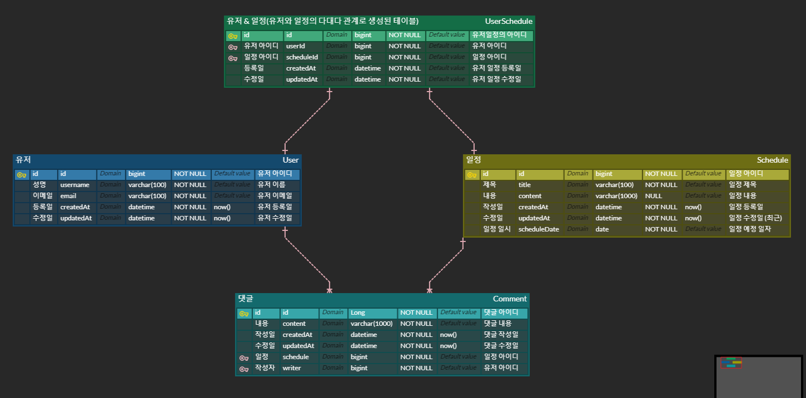

# Spring JPA 를 이용한 일정 관리 앱

* 목표 : Spring 에서의 CRUD 기능을 이해하고 구현할 수 있으며 여러 연관 관계를 
가지는 테이블을 통해 일정 관리 앱을 구현해보자 (JPA 활용하기)

* 기간 : 2024-10-07 ~ 2024-10-17
## 📄 목차
1) API 명세서
2) ERD 소개 및 설명 
3) 필수 구현 기능 소개 (디렉토리 별)
4) 사용 방법
5) 추가 개발 예정 기능
6) 소감

---

### 1️⃣ API 명세서

참고 사이트 : https://documenter.getpostman.com/view/29058403/2sAXxV6AY7

> PostMan 에서 제공하는 API Document 작성 툴을 이용하여 위 사이트에 게시하였습니다.

---

### 2️⃣ ERD 소개 및 설명

#### ERD

> `유저`, `일정`, `댓글` 사이의 관계를 나타내는 ERD 를 그려보았다.
> `유저` 테이블과 `일정` 테이블은 `N:M` 관계 즉 다대다 관계 이기 때문에 
> 중간 테이블을인 `유저&일정` 테이블을 생성하여 관계를 형성 하였다.

---

### 3️⃣ 기능 소개 

(1) : Controller 
> `DispatcherServelet` 에 의해 요청을 전달받는 레이어로서 ERD 로 나타내었던
> `유저`, `댓글`, `일정` ,`유저&일정` 에 대한 CRUD 요청을 처리하는 레이어
> 각 요청들을 서비스 레이어로 연결하여 비즈니스 로직을 수행하게 한다.

(2) : Service 
> 비즈니스 로직을 수행하는 레이어, `Controller` 로 부터 들어온 요청에 대한
> 비즈니스 로직을 수행하며 `Repository` 레이어 와의 연결 또는 
> 회원의 `회원 가입`, `로그인` 에대한 로직을 수행하기도 한다.

(3) : Repository 레이어
> db에 JPA 기술을 이용하여 직접적으로 접근한다. `JPA` 를 사용하기 때문에
> 제공하는 메서드를 통해 `Service` 레이어에서 사용가능하며, 
> 사용자가 원하는 메서드를 선언하여 비즈니스 로직에 맞게 데이터를 다룰 수 있다.

(4) : entity
> 실질적으로 db에 저장될 데이터의 형태를 나타냅니다. 하나의 `필드`가 db 에서 하나의 `column`이 됩니다.
> 또한 이 프로젝트 에서는 여러 테이블간의 관계를 JPA 에서 제공하는 어노테이션을 이용하여
> 테이블 간의 관계를 맺어 주었습니다.
>   추가로 ENUM 클래스에서는 회원 가입된 유저가 ADMIN, USER 인지를 판단하도록
> 설계된 엔티티 입니다.

(5) : dto
> 클라이언트로 부터 요청이 들어올 객체인 requestDto, 응답할 데이터인 responseDto
> 를 구현하는 디렉토리 입니다. `auth` 패키지 내부의 dto 의 경우는 사용자 로그인
> 및 회원 가입에 필요한 요청 정보를 나타내며, 유효성 검사를 통해 해당 입력 값이
> 유효한지 아닌지 판단하게 됩니다.

(6) : GlobalExceptionHandler
> 위 requestDto 에서 들어오는 요청이 유효하지 않은경우 실행되는 핸들러,
> 유효하지 않으면 클라이언트에 설정한 message 를 json 형태로 응답하는 역할

(7) : resources 디렉토리
> 프런트 엔드의 뷰를 구현한 코드들 입니다. thymeleaf 를 사용하여 회원가입 페이지, 로그인 페이지,
> 유저의 권한 정보를 나타내는 메인 페이지를 구현함.

(8) : filter 
> 가장 먼저 클라이언트로 부터의 요청을 담당하게 된다. Controller 에 요청이 도착 하기 전
> 필요한 로직을 수행하기위해 구현된 코드로서, 로깅 기능과 요청으로부터 유효한
> 토큰이 들어온 지 확인하는 역할을 하게 된다.

(9) : JwtUtil
> 토큰을 이용 할 수 있는 여러 메서드를 제공한다. 
> 토큰을 생성하고, 토큰으로 부터 유저 정보를 가져오고, 토큰을 쿠키에 저장하고, 
> 토큰의 공백을 지우는 기능 등, 여러 JWT 에 대한 기능을 제공한다.

(10) : config
> 유저의 비밀번호를 어떤식으로 암호화 할지 설정된 인코더를 나타내는 클래스

---

### 4️⃣ 사용 방법
1. 해당 파일을 클론 또는 zip 파일로 다운로드 합니다.
2. 의존성 설치 및 빌드 작업을 수행합니다.
3. 사용자의 환경에 맞는 db 설정을 application.properties 에 작성합니다.
4. 파일에 있는 `scehdule.sql` 을 실행하여 테이블을 생성합니다.
5. 이후 어플리케이션을 실행하고 localhost:8080 에 접속합니다.
6. 접속 후 유저 회원가입을 하고 로그인을 할 수 있으며 이를 통해 토큰을 지급받을 수 있습니다.
7. 해당 토큰을 이용하여 POSTMAN 의 쿠키 정보에 토큰 값을 입력합니다.
8. 이후 각 테이블에 대한 CURD 작업을 진행 할 수 있습니다.

---

### 5️⃣ 추가 개발 예정 기능
1) 현재 DELETE 메서드에 대한 응답이 void 즉 아무것도 없지만 앞으로
추가할 예정입니다.
2) 날씨 API 를 사용하여 추가적인 정보를 제공할 예정입니다.
3) JWT 를 이용한 인증, 인가를 이용하여 추가적인 권한을 부여 예정 입니다.

---

### 6️⃣ 소감
항상 jwt 를 공부할 때마다 햇갈리고 쉽지 않았던 기억이 있습니다. 
비록 주어진 과제를 모두 수행하지는 못했지만 제일 두려워 했던 jwt 를 이용한  
로그인 구현에 대한 능력을 키우는데 좋은 경험이 되었던 것 같습니다. 
앞으로 추가적은 `Spring Security` 등 여러 배울 것도 많을 텐데 확실하게  
이런 기능들을 공부하고 Spring 에 좀더 흥미를 가지게 된 계기가 된 것 같습니다.

